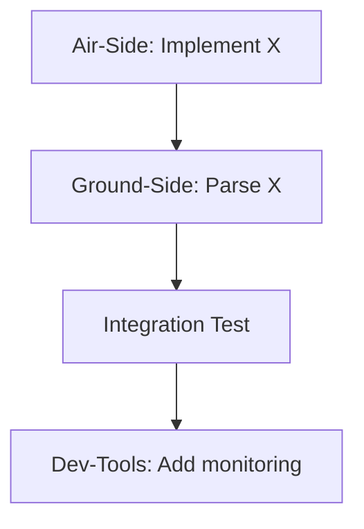

## WHO Tag (REQUIRED)
**WHO:** [CC-Project-Manager | User (name)]

*Note: Cross-domain issues are typically created by PM or User to coordinate work across domains*

## Historical Search (REQUIRED)
**Did you search for similar cross-domain issues?**
- [ ] Yes - Found similar: #___, #___
- [ ] Yes - No similar coordination issues found
- [ ] No - Need to perform search

**Search command used:**
```bash
.github/scripts/search-history.sh "keywords" --show-comments
```

**Related historical issues:**
- Issue #___ - [Brief description of relevance]

## Coordination Overview
**Brief description:**
[One sentence describing what needs to be coordinated]

**Why cross-domain?**
[Explain why this requires multiple domains to work together]

**Affected domains:**
- [ ] Air-Side (Pi 5 C++)
- [ ] Ground-Side (H16 Android)
- [ ] Dev-Tools (SystemTools Python)
- [ ] Protocol (protocol/*.json)
- [ ] Documentation

## Problem Statement
**What is the overall problem?**
[Describe the high-level issue that requires cross-domain coordination]

**Current status across domains:**
- Air-Side: [Current state]
- Ground-Side: [Current state]
- Dev-Tools: [Current state]
- Protocol: [Current state]

## Domain-Specific Issues
**Break down into domain-specific issues:**

### Air-Side Issue
- [ ] Create separate issue: #___
- Summary: [What Air-Side needs to do]
- Priority: [Critical | High | Medium | Low]
- Estimated effort: [hours/days]

### Ground-Side Issue
- [ ] Create separate issue: #___
- Summary: [What Ground-Side needs to do]
- Priority: [Critical | High | Medium | Low]
- Estimated effort: [hours/days]

### Dev-Tools Issue
- [ ] Create separate issue: #___
- Summary: [What Dev-Tools needs to do]
- Priority: [Critical | High | Medium | Low]
- Estimated effort: [hours/days]

## Implementation Order & Dependencies
**Critical path - what must happen in order:**



**Dependency matrix:**
| Step | Domain | Task | Depends On | Blocks |
|------|--------|------|------------|--------|
| 1 | Air-Side | [Task] | - | Step 2 |
| 2 | Ground-Side | [Task] | Step 1 | Step 3 |
| 3 | Integration | [Test] | Steps 1,2 | Step 4 |
| 4 | Dev-Tools | [Task] | Step 3 | - |

## Handoff Points
**Clear handoff definitions between domains:**

### Handoff 1: Air → Ground
**When:** After Air-Side completes [milestone]

**What Air-Side provides:**
- File changes: [list]
- Message format: [specification]
- Documentation: [location]
- Example data: [sample]

**What Ground-Side needs to implement:**
- [Specific task 1]
- [Specific task 2]

**WHO:** CC-Air-Side will document completion in this issue

---

### Handoff 2: Ground → Dev-Tools
**When:** After Ground-Side completes [milestone]

**What Ground-Side provides:**
- UI changes: [description]
- Test results: [summary]
- Known issues: [list]

**What Dev-Tools needs to implement:**
- [Specific task 1]
- [Specific task 2]

**WHO:** CC-Ground-Side will document completion in this issue

---

### Handoff 3: [Add more as needed]

## Protocol Impact
**Protocol changes required:**
- [ ] No protocol changes
- [ ] Protocol extension: [describe]
- [ ] New protocol file: [name]

**Protocol sync checklist:**
- [ ] Air-Side implements protocol specification
- [ ] Ground-Side implements protocol specification
- [ ] Protocol/*.json updated with `implemented: true`
- [ ] Dev-Tools updated (if applicable)

## Testing Strategy

### Unit Testing (Per Domain)
**Air-Side:**
- Test: [What to test]
- Expected: [Expected result]

**Ground-Side:**
- Test: [What to test]
- Expected: [Expected result]

**Dev-Tools:**
- Test: [What to test]
- Expected: [Expected result]

### Integration Testing (Cross-Domain)
**Test scenario 1:**
1. [Setup step]
2. [Action on Ground-Side]
3. [Expected Air-Side behavior]
4. [Expected status update]
5. [Success criteria]

**Test scenario 2:**
[Repeat for additional scenarios]

### Regression Testing
**Ensure existing functionality not broken:**
- [ ] Test existing feature X
- [ ] Test existing feature Y
- [ ] Test existing integration Z

## Risk Assessment
**Potential risks:**
| Risk | Likelihood | Impact | Mitigation |
|------|------------|--------|------------|
| [Risk 1] | High/Med/Low | High/Med/Low | [How to mitigate] |
| [Risk 2] | High/Med/Low | High/Med/Low | [How to mitigate] |

**Rollback plan:**
[If implementation fails, how to rollback safely?]

## Communication Protocol
**How will domains coordinate?**

**Issue updates:**
- Each domain uses WHO tags for all comments
- Status updates required at: [daily | milestone completion | blockers]
- Format:
  ```markdown
  **WHO:** CC-[Domain]
  Status: [In Progress | Complete | Blocked]
  Progress: [% or description]
  Blockers: [None | List]
  Next: [What's next]
  ```

**Coordination meetings (if applicable):**
- Sync point 1: [When and what to discuss]
- Sync point 2: [When and what to discuss]

## Success Criteria
**This cross-domain coordination is complete when:**
- [ ] All domain-specific issues closed
- [ ] Integration tests pass
- [ ] Protocol sync verified
- [ ] Documentation updated across all domains
- [ ] User acceptance testing complete
- [ ] No regressions detected
- [ ] All WHO-tagged updates documented

## Progress Tracking
**Track overall progress here:**

### Air-Side Progress
- [ ] [Milestone 1]
- [ ] [Milestone 2]
- [ ] [Complete]

**WHO:** [Will be updated by CC-Air-Side]

### Ground-Side Progress
- [ ] [Milestone 1]
- [ ] [Milestone 2]
- [ ] [Complete]

**WHO:** [Will be updated by CC-Ground-Side]

### Dev-Tools Progress
- [ ] [Milestone 1]
- [ ] [Milestone 2]
- [ ] [Complete]

**WHO:** [Will be updated by CC-Dev-Tools]

### Integration Status
- [ ] Unit tests passing (all domains)
- [ ] Integration test 1 passing
- [ ] Integration test 2 passing
- [ ] Regression tests passing
- [ ] User acceptance complete

**WHO:** [Will be updated by CC-Project-Manager]

## Timeline
**Estimated timeline:**
- Air-Side: [X hours/days]
- Ground-Side: [Y hours/days]
- Dev-Tools: [Z hours/days]
- Integration: [W hours/days]
- **Total:** [Sum, considering dependencies]

**Critical deadlines:**
- [Milestone]: [Date]
- [Milestone]: [Date]

## Additional Context
[Any other relevant information, architectural diagrams, references, etc.]

## Related Issues
**Related to:**
- Parent issue: #___ (if this is a subtask)
- Child issues: #___, #___, #___ (domain-specific issues)
- Related: #___ (similar coordination)
- Blocks: #___ (must complete before...)
- Blocked by: #___ (depends on...)

---
**Remember:** All domains must use WHO tags in all comments on this issue!

**PM Role:** Project Manager should monitor this issue and coordinate handoffs between domains.
